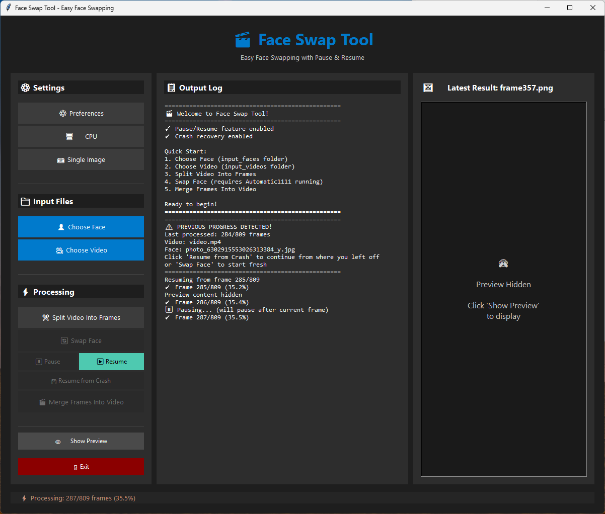

# Face Swap Tool 🎬

A modern, user-friendly desktop application for automated face swapping in videos using Automatic1111 with the Reactor extension. Features a clean GUI with real-time preview, pause/resume capability, and automatic crash recovery.


---

## 📸 Application Preview



*Modern dark-themed interface with three-panel layout: Controls, Output Log, and Live Preview*

---

## ✨ Features

### Core Functionality
- 🎭 **Automated Face Swapping** - Process entire videos with just a few clicks
- 🖼️ **Live Preview** - See processed frames in real-time as they're generated
- ⏸️ **Pause & Resume** - Pause processing anytime and resume later
- 💾 **Crash Recovery** - Automatically recover from crashes without losing progress
- 🎨 **Modern Dark UI** - Clean, professional interface with intuitive controls
- 🔊 **Audio Preservation** - Automatically copies audio from source video

### Processing Options
- **Single Image Mode** - Use one face image for the entire video
- **Image Folder Mode** - Use multiple face images (batch processing)
- **CPU/GPU Toggle** - Switch between CPU and CUDA GPU processing
- **Configurable Settings** - Auto-cleanup, progress saving, and more

### User Experience
- 📊 **Real-time Progress** - Live progress tracking with detailed logging
- 👁️ **Toggle Preview** - Show/hide preview panel to focus on logs
- ⚙️ **Preferences Dialog** - Configure auto-cleanup and save behavior
- 🎯 **Status Indicators** - Clear visual feedback for all operations

---

## 🚀 Quick Start

### Prerequisites

You need working installations of:
- **[Automatic1111](https://github.com/AUTOMATIC1111/stable-diffusion-webui)** - Stable Diffusion WebUI
- **[Reactor](https://github.com/Gourieff/sd-webui-reactor-sfw)** - Face swap extension for SD WebUI
- **Python 3.7+** - Required for running the application

> **Important**: Enable the Automatic1111 API by adding `--api` to `COMMANDLINE_ARGS` in your `webui-user.bat` file.

### Installation

1. **Clone or download** this repository
2. **Run the installer** to set up dependencies and folders:
   ```powershell
   python install.py
   ```
3. **Launch the application**:
   ```powershell
   python app.py
   ```

---

## 📖 How to Use

### Basic Workflow

1. **Prepare Your Files**
   - Place your target video in the `input_videos/` folder
   - Place your face image in the `input_faces/` folder
   - Supported formats: `.mp4` (video), `.png`, `.jpg` (images)

2. **Load Files**
   - Click **"Choose Face"** and select your face image
   - Click **"Choose Video"** and select your target video

3. **Process Video**
   - Click **"Split Video Into Frames"** to extract frames
   - Ensure Automatic1111 is running with the API enabled
   - Click **"Swap Face"** to start processing
   - Watch the live preview and progress in real-time

4. **Finalize**
   - Click **"Merge Frames Into Video"** when processing completes
   - Find your finished video in the `finished_videos/` folder

### Advanced Features

- **Pause/Resume**: Use the "Pause Swap" button during processing, then "Resume Swap" to continue
- **Crash Recovery**: If the app crashes, reopen it and click "Resume from Crash"
- **Preview**: Toggle the preview panel with the "Show/Hide Preview" button
- **Logs**: View detailed logs in the log panel for troubleshooting
- **Settings**: Click the ⚙️ icon to configure auto-cleanup and auto-save options
- **Toggle GPU/CPU**: Switch processing mode with the "Toggle to GPU/CPU" button

---

## 📁 Project Structure

The application uses a clean modular architecture for maintainability and extensibility:

```
face2video/
├── app.py                          # 🚀 Application entry point
├── src/
│   ├── core/                       # Core business logic
│   │   ├── api_handler.py          # Automatic1111 API integration
│   │   ├── video_processor.py      # Video/frame processing
│   │   ├── progress_manager.py     # Crash recovery & state management
│   │   └── face_swap_processor.py  # Face swap orchestration
│   ├── ui/                         # User interface
│   │   ├── styles.py               # Theme & styling constants
│   │   ├── components.py           # Reusable UI widgets
│   │   ├── main_window.py          # Main application window
│   │   └── config_dialog.py        # Settings/preferences dialog
│   └── utils/                      # Utilities
│       ├── file_utils.py           # File operations
│       ├── logger.py               # Logging system
│       └── config_manager.py       # Configuration management
├── docs/                           # Documentation
│   ├── FEATURES.md                 # Detailed feature list
│   ├── QUICK_START.md              # Getting started guide
│   ├── PROJECT_STRUCTURE.md        # Architecture overview
│   └── REFACTORING_COMPLETE.md     # Refactoring history
├── input_faces/                    # Input face images
├── input_videos/                   # Input videos
├── extracted_frames/               # Temporary extracted frames
├── finished_frames/                # Processed frames
└── finished_videos/                # Final output videos
```

---

## ⚙️ Configuration

The application stores configuration in `config.json`:

```json
{
  "delete_frames_after_merge": true,
  "auto_save_progress": true
}
```

- **delete_frames_after_merge**: Auto-cleanup extracted/finished frames after merging
- **auto_save_progress**: Enable automatic progress saving for crash recovery

Access settings via the ⚙️ icon in the application header.

---

## 🔧 Troubleshooting

### Common Issues

**API Connection Failed**
- Ensure Automatic1111 is running
- Verify `--api` flag is in `webui-user.bat`
- Check that the API is accessible at `http://127.0.0.1:7860`

**Processing is Slow**
- Try switching to GPU mode (requires CUDA-compatible GPU)
- Reduce video resolution or length
- Close other GPU-intensive applications

**Crash Recovery Not Working**
- Check that `auto_save_progress` is enabled in settings
- Look for `progress.json` in the project directory
- Ensure you're using the same input files as the crashed session

**Preview Not Updating**
- Check the `finished_frames/` folder for processed frames
- Verify frames are being generated by Automatic1111
- Check the output log for error messages

---

## ⚠️ Limitations

- **Performance**: Face swapping is computationally intensive; processing takes time
- **Quality**: Works best with faces that have minimal movement
- **Talking Faces**: Quality degrades with significant facial movement (e.g., talking)
- **Video Length**: Longer videos require proportionally more processing time

---

## 📚 Documentation

For more detailed information:

- **[FEATURES.md](docs/FEATURES.md)** - Complete feature documentation
- **[QUICK_START.md](docs/QUICK_START.md)** - Detailed getting started guide
- **[PROJECT_STRUCTURE.md](docs/PROJECT_STRUCTURE.md)** - Architecture and code organization
- **[REFACTORING_COMPLETE.md](docs/REFACTORING_COMPLETE.md)** - Development history

---

## 🙏 Acknowledgments

- **[face2video](https://github.com/Arminius-Software/face2video)** - The base project inspiration
- **[Automatic1111](https://github.com/AUTOMATIC1111/stable-diffusion-webui)** - Stable Diffusion WebUI
- **[Reactor](https://github.com/Gourieff/sd-webui-reactor-sfw)** - Face swap extension
- **[ForgeUI](https://github.com/lllyasviel/stable-diffusion-webui-forge)** - Alternative WebUI (also compatible)

---

**Made with ❤️**
